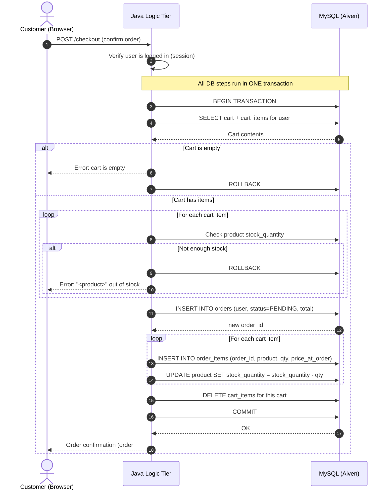
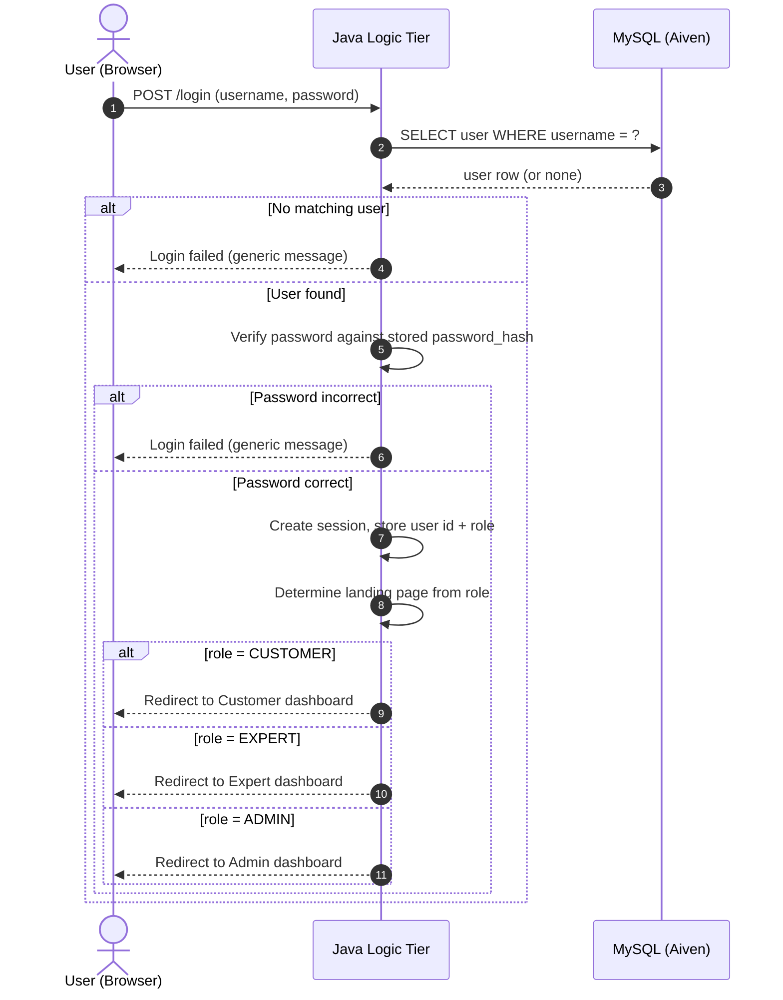

# Sequence Diagrams

Step-by-step interaction diagrams for the project's two most important flows. These are
written in **Mermaid** so they render automatically on GitHub and are easy to keep in sync
with the code as it evolves.

> The visual, spatial diagrams (use case, architecture, class, state) live as `.drawio`
> files in this same folder. Sequence diagrams are kept as text because they're far easier
> to maintain that way and GitHub renders them natively.

---

## 1. Checkout / Place Order (the riskiest flow)

This is the most complex interaction in the system: it must turn a temporary cart into a
permanent order **atomically**. Either every step below succeeds, or none of them do —
otherwise stock and orders could drift out of sync. That's why the database steps run inside
a single **transaction**.

**Key points to call out:**
- **`price_at_order` is captured here** — the order stores the price at purchase time, so it
  stays accurate even if the product's price changes later.
- **Stock is checked *and* decremented inside the transaction** — preventing two shoppers from
  both buying the last item.
- **The cart is cleared only after a successful commit** — if anything fails, the rollback
  leaves the cart untouched so the customer can try again.
- The new order starts in **`PENDING`** (see the Order Status state diagram for what's next).

---

## 2. Login / Authentication

How a returning user signs in and is routed to the dashboard for their role.

**Key points to call out:**
- **Passwords are never compared in plain text** — the app verifies the submitted password
  against the stored `password_hash`.
- **Failure messages are intentionally generic** ("login failed") so they don't reveal
  whether the username or the password was the wrong part.
- **One login flow serves all three roles** — the `role` on the `users` row decides which
  dashboard the user lands on, which is exactly why we used a single accounts table.
